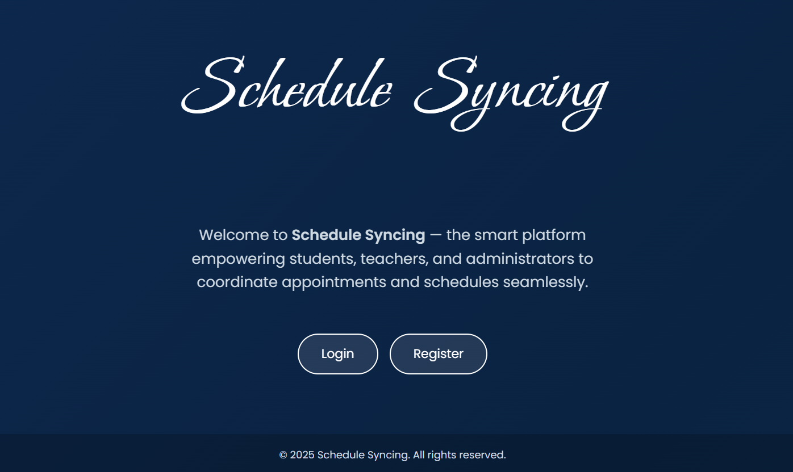
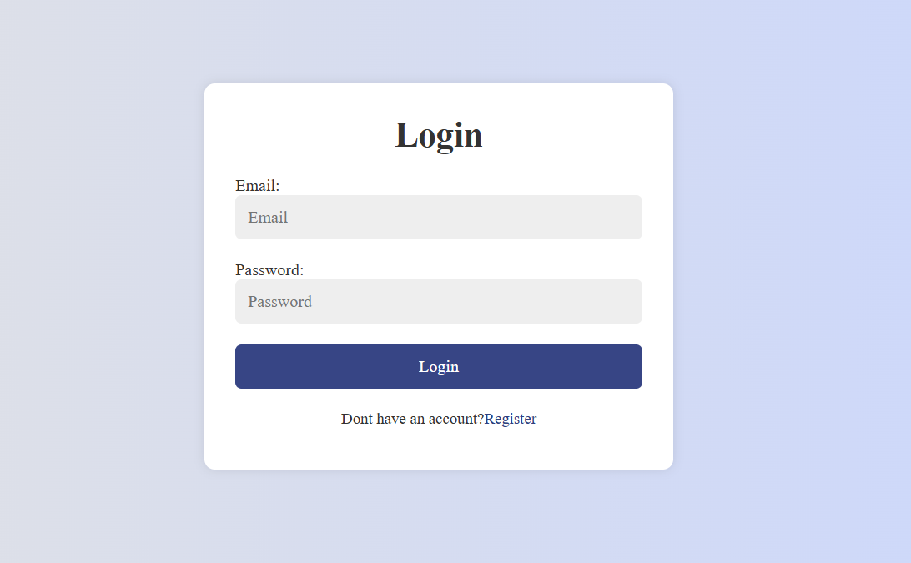
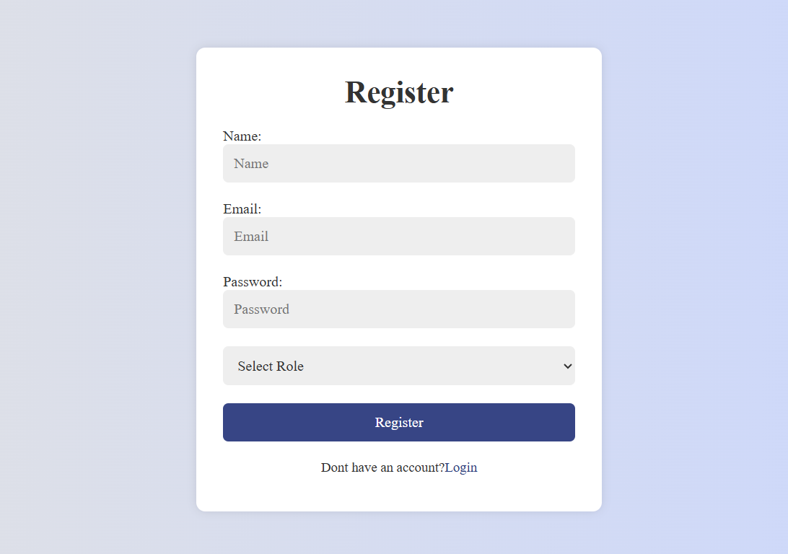
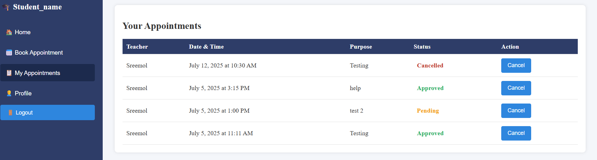
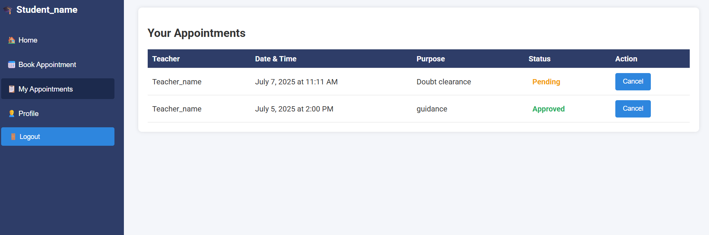
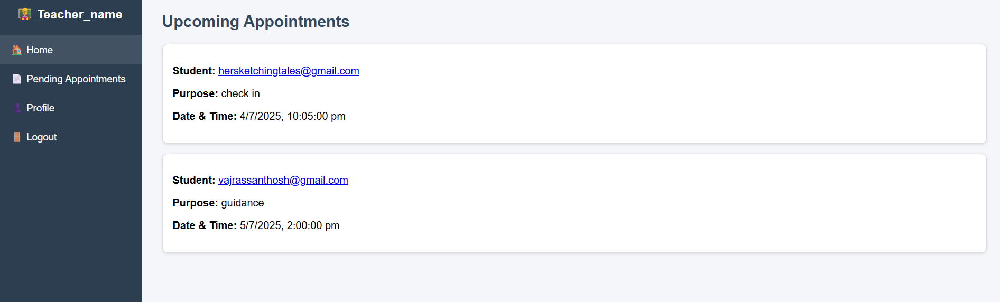
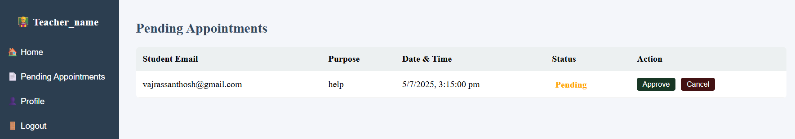

# 📅 Schedule Syncing

**Schedule Syncing** is a web-based appointment coordination system that empowers **students**, **teachers**, and **administrators** to manage and synchronize their schedules effortlessly. The project leverages **Firebase** for authentication and data storage, and provides a clean, modern interface for all users.
checkout:
https://schedulesyncing.netlify.app/

---

## Features

 **Role-Based Login & Registration**
- Students and teachers can create accounts and log in securely.

 **Student Dashboard**
- Book appointments with teachers.
- View and cancel existing appointments.
- Access personal profile information.

 **Teacher Dashboard**
- View pending appointment requests.
- Approve or reject appointments.
- See upcoming approved appointments.
- View profile details.

 **Responsive Design**
- Works smoothly on desktops, tablets, and mobile devices.

 **Modern UI**
- Animated landing page.
- Custom fonts (Poppins and Bonheur Royale).
- Colorful status indicators.

**Realtime Updates**
- Appointment lists update automatically as data changes in Firestore.

---

## Project Structure
/schedule-syncing
│
├── main.html # Landing page with animated background and custom heading font
├── index.html # Login & Register page with Firebase Auth integration
├── student.html # Student dashboard for booking and viewing appointments
├── teacher.html # Teacher dashboard for managing appointments
├── style.css # Shared CSS styles (used by index.html)
├── README.md # Project documentation

---

## 🛠️ Technologies Used

- **HTML5**
- **CSS3**
- **JavaScript**
- **Firebase**
  - Authentication
  - Firestore Database

---
##  Screenshots

###  Landing Page


###  Login & Register



### 🎓 Student Dashboard



### Teacher Dashboard



---
## Testing Guide

- **Landing Page:**
  - Open `main.html` to see the animated gradient background and heading with Bonheur Royale font.

- **Login/Register:**
  - Open `index.html`.
  - Register as **student** or **teacher**.
  - After login, you will be redirected to the correct dashboard.

- **Student Dashboard:**
  - Book an appointment (fill all fields).
  - View your appointments list.
  - Cancel appointments using the cancel button.

- **Teacher Dashboard:**
  - View pending appointments.
  - Approve or cancel requests.
  - View approved appointments in the Home section.
  
- **Admin Dashboard:**
  - View pending appointments.
  - Approve or cancel requests.
  - View approved appointments in the Home section.


- **Logout:**
  - Use the logout buttons (with confirmation popup).

## Firebase Configuration

This project requires a `firebase.js` file with your Firebase project configuration.

Create `firebase.js` in the root folder and add:

```javascript
const firebaseConfig = {
  apiKey: "YOUR_API_KEY",
  authDomain: "YOUR_PROJECT.firebaseapp.com",
  projectId: "YOUR_PROJECT",
  storageBucket: "YOUR_PROJECT.appspot.com",
  messagingSenderId: "YOUR_SENDER_ID",
  appId: "YOUR_APP_ID"
};

